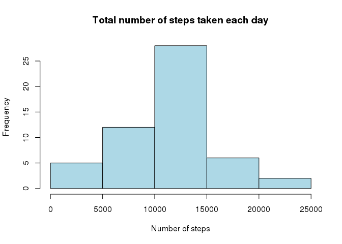
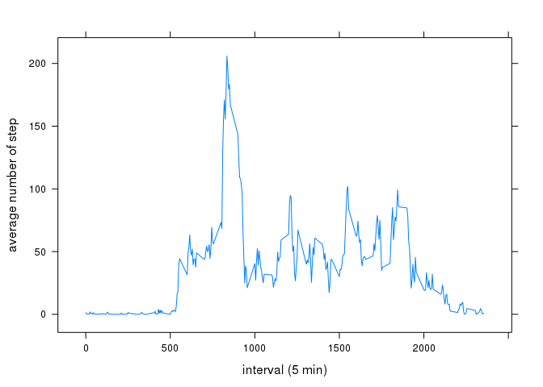
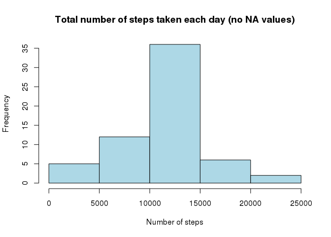
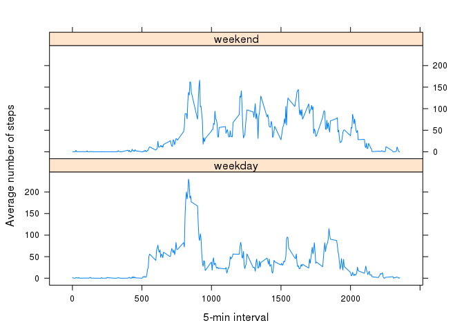

# Reproducible Research: Peer Assessment 1
## Data

The data for this assignment can be downloaded from this [url](https://d396qusza40orc.cloudfront.net/repdata%2Fdata%2Factivity.zip):

The variables included in this dataset are:
* steps: Number of steps taking in a 5-minute interval (missing values are coded as NA)
* date: The date on which the measurement was taken in YYYY-MM-DD format
* interval: Identifier for the 5-minute interval in which measurement was taken

The dataset is stored in a comma-separated-value (CSV) file and there are a total of 17,568 observations in this dataset.

## Loading and preprocessing the data


```r
if (!file.exists("activity.csv"))
{
  download.file("https://d396qusza40orc.cloudfront.net/repdata%2Fdata%2Factivity.zip",
                "repdata_data_activity.zip",
                method="curl")
  unzip("repdata_data_activity.zip")
}

dataset <- read.csv("activity.csv", 
                 header = TRUE, 
                 sep=",",
                 colClasses=c("numeric", "Date", "numeric")
)
```

*Overview*

```r
head(dataset)
```

```
##   steps       date interval
## 1    NA 2012-10-01        0
## 2    NA 2012-10-01        5
## 3    NA 2012-10-01       10
## 4    NA 2012-10-01       15
## 5    NA 2012-10-01       20
## 6    NA 2012-10-01       25
```


## What is mean total number of steps taken per day?

For this part of the assignment, you can ignore the missing values in the dataset.

**Calculate the total number of steps taken per day**

```r
total_steps_per_day <- aggregate(dataset$steps ~ dataset$date, FUN=sum)
names(total_steps_per_day) <- c("date", "total_steps")
```

*Overview*

```r
head(total_steps_per_day)
```

```
##         date total_steps
## 1 2012-10-02         126
## 2 2012-10-03       11352
## 3 2012-10-04       12116
## 4 2012-10-05       13294
## 5 2012-10-06       15420
## 6 2012-10-07       11015
```

**Make a histogram of the total number of steps taken each day**

```r
hist(total_steps_per_day$total_steps,
     right=FALSE,
     col="light blue",
     main="Total number of steps taken each day",
     xlab="Number of steps")
```

 

**Calculate and report the mean and median of the total number of steps taken per day**

```r
mean_total_steps_per_day <- mean(total_steps_per_day$total_steps)

median_total_steps_per_day <- median(total_steps_per_day$total_steps)
```

* *Mean value:* 10766.1886792453
* *Median value:* 10765

## What is the average daily activity pattern?

**Make a time series plot (i.e. type = "l") of the 5-minute interval (x-axis) and the average number of steps taken, averaged across all days (y-axis)**

```r
avg_steps_per_int <- aggregate(dataset$steps ~ dataset$interval, FUN=mean, na.rm = TRUE)
names(avg_steps_per_int) <- c("interval", "avg_step")

require("lattice")
```

```
## Loading required package: lattice
```

```r
xyplot(avg_step ~ interval,
       data = avg_steps_per_int,
       type = "l",
       ylab="average number of step",
       xlab="interval (5 min)")
```

 

**Which 5-minute interval, on average across all the days in the dataset, contains the maximum number of steps?**

```r
interval_with_max_avg_step <-  avg_steps_per_int[which(avg_steps_per_int$avg_step == max(avg_steps_per_int$avg_step)),]["interval"]
```

*Five minute interval has the highest mean number of steps:* 835

## Imputing missing values

Note that there are a number of days/intervals where there are missing values (coded as NA). The presence of missing days may introduce bias into some calculations or summaries of the data.

**Calculate and report the total number of missing values in the dataset (i.e. the total number of rows with NAs)**

```r
NA_count <- length(which(is.na(dataset$steps)))
```

*The total number of missing values in the dataset:*2304

**Devise a strategy for filling in all of the missing values in the dataset**

Strategy: Filling na values with the mean for that 5-minute interval


```r
dataset_working<- merge(dataset, avg_steps_per_int, by = "interval", sort= FALSE)
dataset_working$steps[is.na(dataset_working$steps)] <- dataset_working$avg_step[is.na(dataset_working$steps)]
```

**Create a new dataset that is equal to the original dataset but with the missing data filled in.**


```r
dataset_nona <- dataset_working[, c(2,3,1)]
dataset_nona <- dataset_nona[order(dataset_nona$date, dataset_nona$interval),]
```

**Make a histogram of the total number of steps taken each day and Calculate and report the mean and median total number of steps taken per day.**


```r
total_steps_per_day_nona <- aggregate(dataset_nona$steps ~ dataset_nona$date, FUN=sum)
names(total_steps_per_day_nona) <- c("date", "total_steps")

hist(total_steps_per_day_nona$total_steps,
     right=FALSE,
     col="light blue",
     main="Total number of steps taken each day (no NA values)",
     xlab="Number of steps")
```

 

```r
mean_total_steps_per_day_nona <- mean(total_steps_per_day_nona$total_steps)

median_total_steps_per_day_nona <- median(total_steps_per_day_nona$total_steps)
```

**Do these values differ from the estimates from the first part of the assignment? What is the impact of imputing missing data on the estimates of the total daily number of steps?**

* *New mean value:* 10766.1886792453
* *New median value:* 10766.1886792453

The mean of the first part is 10766.1886792453 as well as the mean of the second part (10766.189). The median of the fist part is 10765 is different from the median of the second part: 10766.1886792453. The impact is limited.

## Are there differences in activity patterns between weekdays and weekends?

**Create a new factor variable in the dataset with two levels – “weekday” and “weekend” indicating whether a given date is a weekday or weekend day.**

IMPORTANT: check your system locale! The 'get_type_of_day' function works with english settings.


```r
get_type_of_day <- function(date) {
    if (tolower(weekdays(date)) %in% c('saturday', 'sunday')) {
        return('weekend')
    } else {
        return('weekday')
    }
}

dataset_nona$day_type <- as.factor(sapply(dataset_nona$date, get_type_of_day))
```

*Overview:*

```r
head(dataset_nona)
```

```
##         steps       date interval day_type
## 1   1.7169811 2012-10-01        0  weekday
## 63  0.3396226 2012-10-01        5  weekday
## 128 0.1320755 2012-10-01       10  weekday
## 205 0.1509434 2012-10-01       15  weekday
## 264 0.0754717 2012-10-01       20  weekday
## 327 2.0943396 2012-10-01       25  weekday
```


**Make a panel plot containing a time series plot (i.e. type = "l") of the 5-minute interval (x-axis) and the average number of steps taken, averaged across all weekday days or weekend days (y-axis).**


```r
summary <- aggregate(dataset_nona$steps, list(interval = dataset_nona$interval, day = dataset_nona$day), 
    mean)
names(summary) <- c("interval", "day", "steps")

require("lattice")
xyplot(steps~interval | day, data = summary,
      type = 'l',
      xlab = '5-min interval',
      ylab = 'Average number of steps',
      layout = c(1,2))
```

 

